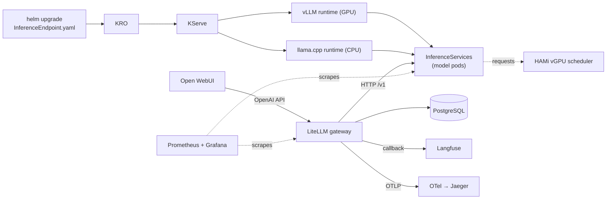

# AI Platform — On-prem PoC

> **Version:** 2.2
> **Last updated:** 2026-06-20
> **Author:** Bogdan
> **Inspiration:** AWS re:Invent 2026 — *"Building an Internal AI Platform with KRO"* — adapted from EKS+Karpenter+ACK to a single-node MicroK8s box with one RTX 3080.

A self-service AI platform that lets a developer apply an `InferenceEndpoint`
YAML and have a model live, observable, and chat-accessible in minutes — on
hardware most people already have on their desk.

| | |
|---|---|
| Target cluster | MicroK8s, single node, `gpu=on` label |
| GPU | NVIDIA RTX 3080 10 GB, vGPU partitioned by HAMi |
| Install model | Helm charts in `charts/` (one per app), applied by `scripts/deploy.sh` |
| Inference runtimes | KServe `ClusterServingRuntime` — vLLM (GPU) + llama.cpp (CPU) |
| Model abstraction | KRO `InferenceEndpoint` CRD (one YAML per model) |
| Gateway | LiteLLM (OpenAI-compatible) |
| Chat UI | Open WebUI |
| Observability | kube-prometheus-stack, Grafana, OTel Collector, Jaeger, Langfuse |

---

## 📚 Documentation

This README is the overview and quick start. The detailed docs live in
[`docs/`](docs/):

| Doc | What's inside |
|---|---|
| **[docs/architecture.md](docs/architecture.md)** | Design goals, recorded architectural decisions, high-/low-level design, component deep-dives, observability architecture, chart/release topology, and the path to production (L40S, MIG+HAMi, HPA). |
| **[docs/deploy_new_models.md](docs/deploy_new_models.md)** | Complete guide to adding/updating/removing models: the full `InferenceEndpoint` field reference, backend selection, multi-GPU (`gpuCards`) tensor parallelism, step-by-step GPU & CPU walkthroughs, the LiteLLM registration flow, sizing, and model troubleshooting. |
| **[docs/documentation.md](docs/documentation.md)** | Install & operations manual: prerequisites, installation, UIs & credentials, using the platform, observability, GPU-sharing verification, testing, cheat-sheet, troubleshooting, hardening, upgrades/teardown, and repo layout. |
| **[tests/README.md](tests/README.md)** | The end-to-end / integration test suite. |

---

## What it is

Apply one `InferenceEndpoint` YAML; get a live, GPU-partitioned, observable,
OpenAI-compatible, chat-accessible model:

```text
helm upgrade applies InferenceEndpoint YAML  ← developer action
   ↓ KRO expands the CR                       ← abstraction
   ↓ KServe creates Deployment + Service      ← serving infra
   ↓ HAMi schedules onto a vGPU slice         ← GPU sharing
   ↓ vLLM/llama.cpp loads the weights         ← model load
   ↓ Job registers the model in LiteLLM       ← gateway
   ↓ Model appears in Open WebUI              ← user access
```

**Non-goals (deliberate):** production-grade hardening, training/fine-tuning.
Multi-GPU tensor parallelism *is* implemented (`gpuCards`), but the reference
node has one GPU so examples ship `gpuCards: 1`. Details and rationale in
[docs/architecture.md](docs/architecture.md#1-context--goals).

## Architecture at a glance



Full diagrams (request flow, HAMi allocation, span trees) are in
[docs/architecture.md](docs/architecture.md#3-high-level-design).

## Models bundled in the PoC

| LiteLLM alias | Backend | HF model | GPU/RAM slice | Context |
|---|---|---|---|---|
| `gemma-1b-fast` | vLLM (GPU/HAMi) | `Qwen/Qwen2.5-Coder-1.5B-Instruct-AWQ` | 40 % vRAM (~4 GB) | 16384 |
| `smollm3-3b-quality` | vLLM (GPU/HAMi) | `Qwen/Qwen2.5-0.5B-Instruct-AWQ` | 40 % vRAM (~4 GB) | 16384 |
| `qwen-3b-cpu` | llama.cpp (CPU) | `Qwen/Qwen2.5-3B-Instruct-GGUF` q4_k_m | ~3 GB RAM | 16384 |

(The `gemma-1b-fast` slot serves Qwen2.5-Coder-1.5B — the original TinyLlama's
2048-token window was too small for coding agents.) The two GPU models share the
10 GB RTX 3080 (40 % + 40 % vRAM, 35 % + 35 % cores)
via HAMi. Context windows are bounded by what each model's KV cache fits in its
slice — see [docs/deploy_new_models.md §9](docs/deploy_new_models.md#9-sizing-guide).

Add your own: [docs/deploy_new_models.md](docs/deploy_new_models.md).

---

## Quick start

```bash
# 1. Map *.local.ro hostnames to 127.0.0.1 (once per workstation)
sudo ./scripts/update-local-hosts.sh

# 2. Install the whole stack (idempotent — re-run = upgrade)
./scripts/deploy.sh

# 3. (Optional) load a Hugging Face token for gated models
HUGGINGFACE_TOKEN=hf_xxx ./scripts/deploy.sh
```

First install takes 15–30 min (image pulls + first model weights). The script
prints access URLs and live credentials when it finishes. Full prerequisites and
options: [docs/documentation.md](docs/documentation.md#2-prerequisites).

## UIs & credentials

| UI / endpoint | URL | Login |
|---|---|---|
| Open WebUI | http://open-webui.local.ro | first signup → admin |
| Langfuse | http://langfuse.local.ro | first signup → admin |
| Grafana | http://grafana.local.ro | `admin` / secret below |
| Jaeger | http://jaeger.local.ro | no auth |
| LiteLLM API | http://litellm.local.ro | Bearer `LITELLM_MASTER_KEY` |

```bash
# Grafana admin password
microk8s kubectl -n observability get secret kube-prom-stack-grafana \
  -o go-template='{{index .data "admin-password" | base64decode}}{{"\n"}}'
# LiteLLM master key
microk8s kubectl -n ai-platform get secret litellm-secrets \
  -o go-template='{{index .data "LITELLM_MASTER_KEY" | base64decode}}{{"\n"}}'
```

> Default master key is `sk-litellm-master-change-me` — **rotate before any
> non-lab use.**

## Test it

```bash
LITELLM_KEY="$(microk8s kubectl -n ai-platform get secret litellm-secrets \
  -o go-template='{{index .data "LITELLM_MASTER_KEY" | base64decode}}')" \
python3 tests/e2e_smoke.py
```

The suite checks every component — LiteLLM, each deployed model, Grafana,
Jaeger, Langfuse, Open WebUI, Prometheus, and (when `kubectl` is available)
in-cluster readiness. See [tests/README.md](tests/README.md).

## Use from OpenCode (coding agent)

The gateway is OpenAI-compatible, so [OpenCode](https://opencode.ai) (and
similar IDE agents) can drive these models. Config lives in `opencode/config/`:

```bash
# Regenerate opencode.json from LiteLLM's live model list
LITELLM_KEY="$(microk8s kubectl -n ai-platform get secret litellm-secrets \
  -o go-template='{{index .data "LITELLM_MASTER_KEY" | base64decode}}')" \
LITELLM_KEY="$LITELLM_KEY" python3 opencode/config/update-config.py
```

Each model gets a `limit: {context, output}` matching its server-side window, so
the agent never overflows a small model's KV cache. All three aliases now carry a
16384-token window, so any of them works in OpenCode (`gemma-1b-fast` is
coding-tuned Qwen2.5-Coder-1.5B with tool calling enabled). Details:
[docs/documentation.md §6](docs/documentation.md#6-using-the-platform).

---

## Repo layout

```text
.
├── README.md                         this overview
├── docs/                             architecture, deploy_new_models, documentation
├── charts/                           Helm charts — source of truth (one per app)
│   ├── namespaces/  cert-manager/  observability-stack/
│   ├── hami/  kro/  kserve-crd/  kserve/
│   ├── kro-templates/          the InferenceEndpoint RGD
│   ├── postgresql/  litellm/  langfuse/  open-webui/  jaeger/  otel-collector/
│   ├── serving-runtimes/             vLLM + llama.cpp ClusterServingRuntimes
│   ├── monitoring/                   Grafana dashboards + HAMi ServiceMonitors
│   └── ai-models/                    example InferenceEndpoints + register Jobs
├── opencode/config/                  OpenCode client config + generator script
├── scripts/
│   ├── deploy.sh            one-shot installer / upgrader
│   └── update-local-hosts.sh         maps *.local.ro hostnames to 127.0.0.1
└── tests/                            stdlib-only e2e/integration suite
```

A per-chart breakdown is in
[docs/architecture.md §7](docs/architecture.md#7-chart--release-topology).

## References

KServe · KRO · HAMi · vLLM · llama.cpp · LiteLLM · Langfuse · OpenTelemetry ·
Jaeger — links collected in
[docs/architecture.md §10](docs/architecture.md#10-references).
