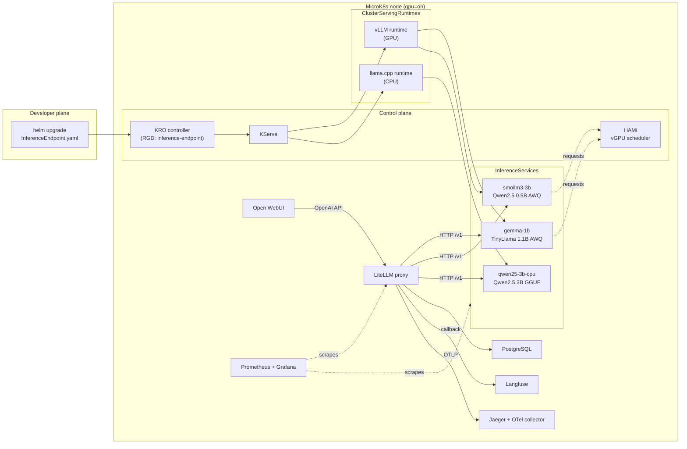
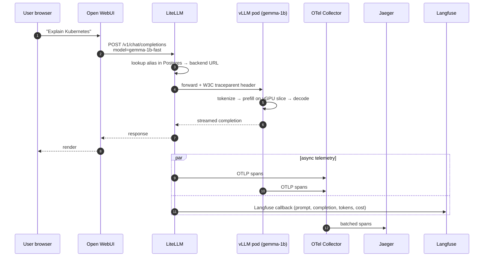
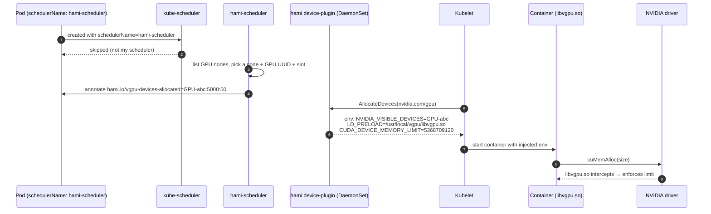

# QSINT AI Platform — On-prem PoC

> **Version:** 2.0  
> **Last updated:** 2026-06-19
> **Author:** Bogdan  
> **Inspiration:** AWS re:Invent 2026 — "Building an Internal AI Platform with KRO" — adapted from EKS+Karpenter+ACK to a single-node MicroK8s box with one RTX 3080.

A self-service AI platform that lets a developer apply an
`InferenceEndpoint` YAML and have a model live, observable and chat-accessible
in minutes — on hardware most people already have on their desk.

| | |
|---|---|
| Target cluster | MicroK8s, single node, `gpu=on` label |
| GPU | NVIDIA RTX 3080 10 GB, vGPU partitioned by HAMi |
| Install model | Helm charts in `charts/`, applied by `scripts/deploy-microk8s.sh` |
| Inference runtimes | KServe `ClusterServingRuntime` — vLLM (GPU) + llama.cpp (CPU) |
| Model abstraction | KRO `InferenceEndpoint` CRD (one YAML per model) |
| Gateway | LiteLLM (OpenAI-compatible) |
| Chat UI | Open WebUI |
| Observability | kube-prometheus-stack, Grafana, OTel Collector, Jaeger, Langfuse |

---

## Table of contents

1. [Goals & non-goals](#1-goals--non-goals)
2. [Why it exists](#2-why-it-exists)
3. [Architectural decisions](#3-architectural-decisions)
4. [High-level design (HLD)](#4-high-level-design-hld)
5. [Low-level design (LLD)](#5-low-level-design-lld)
6. [Components in detail](#6-components-in-detail)
7. [Observability stack](#7-observability-stack)
8. [Models deployed in this PoC](#8-models-deployed-in-this-poc)
9. [Local UIs & credentials](#9-local-uis--credentials)
10. [Prerequisites](#10-prerequisites)
11. [Install](#11-install)
12. [Add a new model](#12-add-a-new-model)
13. [Tests](#13-tests)
14. [Verify GPU sharing](#14-verify-gpu-sharing)
15. [Read distributed traces in Jaeger](#15-read-distributed-traces-in-jaeger)
16. [Troubleshooting](#16-troubleshooting)
17. [Production hardening checklist](#17-production-hardening-checklist)
18. [Path to production with L40S](#18-path-to-production-with-l40s)
19. [CPU backend with llama.cpp](#19-cpu-backend-with-llamacpp)
20. [Repo layout](#20-repo-layout)
21. [Cheat-sheet](#21-cheat-sheet)
22. [References](#22-references)

---

## 1. Goals & non-goals

### What the PoC does

Reproduce the AWS slide deck developer experience on a single consumer GPU:
a developer applies `charts/qsint-workloads/templates/new-model.yaml` with Helm,
KRO expands the abstraction into KServe + a registration Job, and within
minutes the model is:

```text
helm upgrade applies InferenceEndpoint YAML  ← developer action
   ↓
KRO expands the InferenceEndpoint CR      ← abstraction layer
   ↓
KServe creates the Deployment + Service   ← serving infra
   ↓
HAMi schedules the pod onto a vGPU slice  ← GPU sharing
   ↓
vLLM downloads the weights from HF        ← model load
   ↓
Job registers the model in LiteLLM        ← gateway registration
   ↓
Model appears in Open WebUI               ← user access
```

### What it deliberately does **not** do

- **Production-grade hardening.** Master keys are hard-coded, single replica
  on critical services, plain-HTTP ingresses. See [§17](#17-production-hardening-checklist).
- **Multi-GPU tensor-parallel inference.** Single-GPU only. For TP=4 on H200,
  see [§18](#18-path-to-production-with-l40s).
- **Training / fine-tuning.** Serving only.

---

## 2. Why it exists

Three reasons, in order of importance:

1. **Validate the stack.** Prove KRO + KServe + HAMi + LiteLLM + Open WebUI +
   Langfuse + Jaeger compose into a coherent on-prem platform. The AWS talk is
   EKS-centric (Karpenter, ACK, Knative); we need to show the same logic ports
   to MicroK8s/kubeadm with open-source equivalents.
2. **Foundation for QSINT prod.** Every decision here (KServe vs Ray, HAMi vs
   MIG, single gateway vs direct routing) is a decision that has to hold up on
   L40S/H200 hardware later. Better to be wrong now, on hardware that costs
   nothing per hour, than during the migration.
3. **Self-service developer experience.** Once the platform is up, the team
   adds models with a Helm upgrade — they never touch infrastructure. This is
   what scales the team.

---

## 3. Architectural decisions

Each choice is recorded with its trade-offs and the alternatives that were
rejected.

### 3.1 KServe RawDeployment instead of Ray Serve

| Aspect | Choice | Reason |
|---|---|---|
| Serving runtime | KServe RawDeployment | Single-GPU = no distributed inference needed. Standard HPA + clean ServingRuntime pattern. |
| Mode | RawDeployment (no Knative) | vLLM cold-start of 60–300 s makes scale-to-zero impractical. Knative adds queue-proxy + Istio. |
| vLLM runtime | Custom `ClusterServingRuntime` | KServe ships TGI/Triton/MLServer out of the box, not vLLM. |

**Rejected:**
- **Ray Serve + KubeRay** — overkill on a single GPU. Re-evaluate at multi-GPU TP.
- **Plain vLLM Deployment** — loses the inference abstraction, autoscaling, standard inference protocol.
- **Triton Inference Server** — more mature but harder to wire to OpenAI-compatible chat APIs.

### 3.2 HAMi for GPU sharing

| Aspect | Choice | Reason |
|---|---|---|
| GPU sharing | HAMi vRAM partitioning | Only option with **real vRAM isolation** on a consumer GPU. |

**Rejected:**
- **NVIDIA time-slicing** — zero memory isolation; one pod allocating 9 GB OOMs the rest.
- **MIG** — not supported on RTX 3080 (Ampere consumer). Reserve for the L40S path.
- **MPS** — good for latency but no vRAM isolation; complex in K8s.

### 3.3 KRO for the abstraction layer

| Aspect | Choice | Reason |
|---|---|---|
| Abstraction layer | KRO `ResourceGraphDefinition` | First-class CRD, controller reconciliation loop, typed schema, automatic status aggregation. |

**Rejected:**
- **Helm chart with values.yaml** — templating only, no controller loop.
- **Crossplane v2** — more mature but significant overhead.
- **Custom Kubebuilder operator** — maximum control, weeks of work.

**Accepted risk:** KRO is `v1alpha1`. The API may change. Re-evaluate in 6 months.

### 3.4 Shared PostgreSQL for LiteLLM + Langfuse

One PostgreSQL StatefulSet with two logical databases (`litellm`, `langfuse`).
Same "Platform DB" pattern as the AWS slide.

**Rejected:**
- **One Postgres per service** — wasted RAM on a homelab; OK for prod.
- **SQLite in-process** — blocks multi-replica HPA scaling for LiteLLM.

### 3.5 LiteLLM as the single gateway

Every request transits LiteLLM, regardless of backend (local vLLM, OpenAI,
Anthropic, Bedrock, …). Benefits: per-team budgets, virtual API keys, unified
callbacks (Langfuse + OTel), A/B testing by swapping aliases.

**Accepted risk:** SPOF + ~10–20 ms latency overhead. Mitigated by HPA + 2+
replicas in prod.

### 3.6 OTel Collector instead of direct-to-Jaeger

A central OTel Collector. Clients emit OTLP; the collector routes to the
backend(s). Best practice.

**Why:**
- Swap backend (Tempo, Datadog, Honeycomb) without touching clients.
- `k8sattributes` processor enriches spans with pod / namespace / node.
- Memory-limiter processor protects against spike OOMs.
- Tail sampling becomes possible later.

**Rejected:** direct OTLP → Jaeger, Jaeger Agent (deprecated).

### 3.7 Jaeger all-in-one for the PoC

Single pod, in-memory storage. Easy to demo; traces vanish on restart. In prod
this becomes Jaeger Production with the existing QSINT Elasticsearch backend,
or a migration to Grafana Tempo.

### 3.8 Helm + a single bootstrap script

The PoC is installed by `scripts/deploy-microk8s.sh`, a deliberate chain of
`helm upgrade --install` commands. The script is idempotent: re-running it is
the supported upgrade and reconciliation path for every bundled chart.

---

## 4. High-level design (HLD)

### 4.1 Component map



### 4.2 Namespace map

| Namespace | What lives here |
|---|---|
| `cert-manager` | cert-manager controller + CRDs |
| `kserve` | KServe controller, webhooks, CRDs |
| `kro-system` | KRO controller + RGDs |
| `kube-system` | HAMi scheduler + device plugin DaemonSet |
| `observability` | kube-prometheus-stack (Prometheus, Alertmanager, Grafana) |
| `ai-platform` | LiteLLM, Open WebUI, Langfuse, PostgreSQL, Jaeger, OTel Collector, ingresses |
| `inference` | `InferenceEndpoint` CRs, `InferenceServices`, model pods, registration Jobs, shared model-cache PVC |

### 4.3 Request flow — one end-to-end inference



---

## 5. Low-level design (LLD)

### 5.1 `InferenceEndpoint` → expanded resources

A developer commits:

```yaml
apiVersion: kro.run/v1alpha1
kind: InferenceEndpoint
metadata:
  name: gemma-1b
  namespace: inference
spec:
  backend: vllm
  model: "TheBloke/TinyLlama-1.1B-Chat-v1.0-AWQ"
  servedName: "gemma-1b"
  gpuMemMb: 5000
  gpuMemPercentage: 30
  gpuCorePercent: 35
  quantization: "awq"
  maxModelLen: 2048
  gpuMemUtilization: "0.85"
  litellmAlias: "gemma-1b-fast"
```

The `inference-endpoint` RGD expands this into two children, plus a derived
chain managed by KServe:

```
InferenceEndpoint (KRO)
   │
   ├─ KServe InferenceService           ← rendered by KRO
   │     ├─ Deployment                  ← rendered by KServe
   │     │    └─ Pod (schedulerName: hami-scheduler)
   │     │         └─ container: vllm/vllm-openai:v0.6.3
   │     ├─ Service (ClusterIP :80 → :8000)
   │     └─ HPA (min=1, max=1)
   │
   └─ Job: <name>-litellm-register      ← rendered by KRO
         ├─ wait for /v1/models on the pod
         └─ POST /model/new on LiteLLM
```

The Job is gated on `/v1/models` returning 200 from the new pod, so it never
races KServe's readiness.

### 5.2 HAMi vGPU allocation in detail



The crucial detail: `CUDA_DEVICE_MEMORY_LIMIT` is enforced *inside the
container* by `libvgpu.so` intercepting CUDA driver calls. Two pods on the
same physical GPU therefore each see "their" 5 GB and OOM cleanly if they try
to allocate more.

### 5.3 Chat-template fallback in the vLLM runtime

Some HF quants (notably `Qwen/Qwen2.5-0.5B-Instruct-AWQ`) ship without a
`chat_template` in `tokenizer_config.json`. transformers ≥ 4.44 refuses to
synthesize one. To keep the runtime generic, the startup script in
`charts/qsint-platform/templates/13-vllm-servingruntime.yaml`:

1. Probes the tokenizer with `AutoTokenizer.from_pretrained(MODEL_ID)`.
2. Checks whether `tokenizer.chat_template` is truthy.
3. If missing, passes `--chat-template=/etc/vllm/chatml.jinja` (mounted from
   the `vllm-chat-templates` ConfigMap — a generic ChatML).
4. If present, leaves the model's own template alone — never clobbered.

This way new ungated quants work even when their authors forgot the template,
without degrading models that ship their own.

### 5.4 Distributed tracing — end-to-end span tree

```
litellm-proxy / POST /v1/chat/completions   [340 ms]
├── litellm-proxy / litellm.routing         [2 ms]
└── litellm-proxy / POST gemma-1b-pred      [336 ms]
    └── vllm-inference / vllm.chat_comp     [330 ms]
        ├── vllm.tokenize                   [3 ms]
        ├── vllm.prefill                    [120 ms]
        └── vllm.decode (50 tokens)         [205 ms]
```

After the `k8sattributes` processor runs, each span carries
`k8s.namespace.name`, `k8s.pod.name`, `k8s.deployment.name`, `k8s.node.name`,
plus resource attributes `service.name`, `service.namespace`,
`deployment.environment=poc`.

### 5.5 LiteLLM model registration sequence

```
Job: gemma-1b-litellm-register
  │
  1. wait loop (up to 30 minutes):
  │    until curl -sf http://gemma-1b-predictor.../v1/models; do sleep 10; done
  │
  2. POST http://litellm.ai-platform.svc:4000/model/new
  │    Authorization: Bearer $LITELLM_MASTER_KEY
  │    body:
  │      model_name:    "gemma-1b-fast"
  │      litellm_params:
  │        model:    "openai/gemma-1b"
  │        api_base: "http://gemma-1b-predictor.inference.svc.cluster.local/v1"
  │        api_key:  "dummy-not-required-for-self-hosted"
  │      model_info:
  │        id: "gemma-1b"
  │        description: "TheBloke/TinyLlama-1.1B-Chat-v1.0-AWQ via KServe + vLLM GPU"
  │
  3. LiteLLM:
  │    - validate master key
  │    - INSERT INTO model_table
  │    - reload internal router config (no restart needed)
  │    - 200 OK
  │
  4. Job exits 0 → ttlSecondsAfterFinished cleans it up an hour later.
```

---

## 6. Components in detail

### 6.1 KRO — Kube Resource Orchestrator

**Role.** Define high-level CRDs (`InferenceEndpoint`) that expand into one
or more low-level Kubernetes objects (`InferenceService` + `Job`).

**Why KRO.** First-class CRDs (your developers `kubectl get
inferenceendpoints` and it just works). Typed schema with defaults. CEL
expressions for substitution. Controller-loop reconciliation, not just
templating.

**Concepts.**
- **Schema** — the developer-facing CRD shape.
- **Resources** — the list of low-level objects produced.
- **CEL substitution** — `${schema.spec.gpuMemMb}` etc., evaluated at apply
  time.

The repo ships exactly one RGD: `inference-endpoint` (see
`charts/qsint-kro-templates/templates/inference-endpoint-rgd.yaml`). It is
multi-backend: `spec.backend: vllm` selects the GPU runtime, `spec.backend:
llamacpp` selects the CPU runtime.

### 6.2 KServe — model serving abstraction

**Role.** Turn an `InferenceService` (one model) into a Deployment + Service
+ HPA, picking the right `ClusterServingRuntime` based on `modelFormat`.

**Why KServe.**
- Decouples *what* (the model) from *how* (vLLM, Triton, llama.cpp, …).
- Standard inference protocol (v2).
- HPA integration out of the box.
- Per-model storage initializers (PVC, S3, OCI modelcar) if you want them.

**RawDeployment mode** (vs Knative-backed) — chosen because vLLM cold-starts
in minutes; scale-to-zero is the wrong trade.

### 6.3 HAMi — vGPU virtualisation

**Role.** Software GPU virtualization. Multiple pods share one physical GPU
with hard vRAM limits and soft compute caps.

**Why HAMi.** It's the *only* path on a consumer card. MIG requires
A100/H100/L40S. Time-slicing has no memory isolation. MPS has no memory
isolation either. HAMi enforces limits inside the container with
`libvgpu.so`, which intercepts CUDA driver calls and returns
`CUDA_ERROR_OUT_OF_MEMORY` past the slice.

**Components in the cluster.**

| Component | Where | Role |
|---|---|---|
| `hami-scheduler` (Deployment) | `kube-system` | Custom scheduler; only sees pods with `schedulerName: hami-scheduler`. |
| `hami-device-plugin` (DaemonSet) | `kube-system` | Advertises `nvidia.com/gpu`, `gpumem`, `gpucores`; injects `libvgpu.so`. |
| `hami-webhook` (optional) | `kube-system` | Mutating webhook to auto-attach the scheduler name. |

**Resource model.**

| Resource | Unit | Meaning |
|---|---|---|
| `nvidia.com/gpu` | count | Number of vGPUs (1/pod, default) |
| `nvidia.com/gpumem` | MiB | **Hard** vRAM cap |
| `nvidia.com/gpucores` | % | **Soft** compute share |

### 6.4 vLLM `ClusterServingRuntime`

Defined in `charts/qsint-platform/templates/13-vllm-servingruntime.yaml`.

| Field | Value |
|---|---|
| Image | `vllm/vllm-openai:v0.6.3` |
| API | OpenAI-compatible on port 8000 |
| Quantization | AWQ (configurable per InferenceService) |
| Prefix caching | enabled (RadixAttention) |
| OTLP traces | enabled (`--otlp-traces-endpoint=otel-collector:4317`) |
| Scheduler | `hami-scheduler` |
| HF auth | optional secret reference (gated models) |
| Model cache | RWX PVC, shared across pods |
| Chat-template fallback | ChatML via ConfigMap, used only when the tokenizer is missing one |

Args parameterised per InferenceService:

```
--model=$(MODEL_ID)
--served-model-name=$(SERVED_NAME)
--quantization=$(QUANTIZATION)
--max-model-len=$(MAX_MODEL_LEN)
--gpu-memory-utilization=$(GPU_MEM_UTIL)
[--chat-template=/etc/vllm/chatml.jinja]   ← only when tokenizer lacks one
```

### 6.5 llama.cpp `ClusterServingRuntime` (CPU)

Defined in `charts/qsint-platform/templates/14-llamacpp-servingruntime.yaml`.

| Field | Value |
|---|---|
| Image | `ghcr.io/ggerganov/llama.cpp:server-b4404` |
| API | OpenAI-compatible on port 8080 |
| GPU | none requested |
| Threads | configurable per model |
| Model file | GGUF on the shared cache PVC |
| Cold start | `wget` the GGUF on first boot if not present |

See [§19](#19-cpu-backend-with-llamacpp) for the full story.

### 6.6 LiteLLM proxy

**Role.** Unified OpenAI-compatible gateway over any backend. Local vLLM,
local llama.cpp, OpenAI, Anthropic, Bedrock, Azure — same surface.

**What we use.**
- Model routing by alias.
- Master-key auth for `/model/new`.
- PostgreSQL backend (model list survives restarts).
- Callbacks: `langfuse`, `otel`.
- Prometheus metrics on `/metrics`.

**Why a gateway at all.** Single point for per-team budgets, virtual keys,
unified callbacks (one OTel pipeline, one Langfuse hook), A/B testing by
alias swap, and graceful fallback (GPU primary, CPU backup).

### 6.7 Open WebUI

**Role.** ChatGPT-like UI. Configured to talk to LiteLLM as its OpenAI
backend. Auto-discovers models via `/v1/models` and shows them in the
dropdown.

```text
OPENAI_API_BASE_URL = http://litellm.ai-platform.svc.cluster.local:4000/v1
OPENAI_API_KEY      = <litellm-master-key>
```

The first user to sign up becomes admin.

### 6.8 Langfuse

**Role.** LLM-specific observability. Unlike Jaeger (generic distributed
tracing), Langfuse is specialised: prompt/completion logging, token counts,
cost attribution, evaluation runs, dataset management.

**Components.** Next.js web UI + API, shared PostgreSQL.

**Wired up via** LiteLLM's `success_callback: [langfuse, otel]`.

### 6.9 PostgreSQL (shared)

Single StatefulSet. Init script creates two logical databases (`litellm`,
`langfuse`). Credentials in a K8s Secret. Sufficient for PoC; in prod, swap
for CloudNativePG with replication and pgBackRest backups.

### 6.10 OTel Collector + Jaeger

**Collector.** Receives OTLP/gRPC on `:4317`, enriches with
`k8sattributes`, batches, and forwards to Jaeger over OTLP. Also exposes
Prometheus metrics for self-monitoring.

**Jaeger.** All-in-one for the PoC (in-memory storage); production should
swap to ES or Tempo.

---

## 7. Observability stack

### 7.1 The pillars

| Pillar | Tool | Where to look |
|---|---|---|
| Metrics | Prometheus + Grafana | `grafana.local.ro` |
| Traces | OTel Collector + Jaeger | `jaeger.local.ro` |
| Logs | (your existing Loki, if you wire it) | n/a in PoC |
| LLM-specific | Langfuse | `langfuse.local.ro` |

### 7.2 Metric sources

| Source | Endpoint | Scraped by |
|---|---|---|
| vLLM pods | `:8000/metrics` | `PodMonitor` `vllm-inference-pods` |
| LiteLLM | `litellm:4000/metrics` | `ServiceMonitor` |
| HAMi scheduler | `hami-scheduler:metrics` | `ServiceMonitor` |
| HAMi device plugin | `hami-device-plugin:metrics` | `ServiceMonitor` |
| OTel Collector | `:8888,:8889/metrics` | `ServiceMonitor` |
| Jaeger | `:14269/metrics` | `ServiceMonitor` |

### 7.3 Bundled Grafana dashboards

Auto-imported via the Grafana sidecar from `charts/qsint-platform/files/dashboards/`
and published to the `qsint-ai-platform-dashboards` /
`hami-native-dashboard` ConfigMaps in the `observability` namespace.

**Populated by this PoC:**

| Dashboard | Source | What it shows |
|---|---|---|
| **HAMi GPU Split — Native Metrics** | bundled (`hami-native-dashboard.yaml`) | Per-pod vRAM, per-pod compute %, host-level GPU view, scheduler-view allocation, quota usage. Uses the real HAMi series (`vGPU_device_memory_*`, `HostCoreUtilization`, `vGPUMemoryAllocated`, `GPUDeviceCoreAllocated`). |
| **QSINT — vLLM Inference** | bundled (`vllm.json`) | Active / queued requests, TTFT and TPOT percentiles per model, KV-cache utilisation, token throughput. Populates as soon as either GPU model handles traffic. |

**Bundled but empty in this PoC** (kept for future runtimes — per the
[KServe dashboards docs](https://kserve.github.io/website/docs/model-serving/predictive-inference/observability/grafana-dashboards)):

| Dashboard | grafana.com ID | Populates when |
|---|---|---|
| KServe ModelServer Latency | [17969](https://grafana.com/grafana/dashboards/17969) | A KServe Python ModelServer SDK runtime (lgbserver, sklearn, xgb…) is deployed — emits `request_predict_seconds` histograms. |
| KServe TorchServe Latency | [18026](https://grafana.com/grafana/dashboards/18026) | A TorchServe `ClusterServingRuntime` is deployed. |
| KServe Triton Latency | [18027](https://grafana.com/grafana/dashboards/18027) | A Triton `ClusterServingRuntime` is deployed. |
| Knative Serving HTTP Requests | [18032](https://grafana.com/grafana/dashboards/18032) | KServe is switched from `RawDeployment` to Knative-backed serverless. |

**Dashboards we deliberately removed** (and why — so they don't reappear):

- *QSINT — HAMi vGPU Per-Pod* — assumed metric names (`hami_vgpu_memory_used_bytes`, etc.) that HAMi never emitted; the **HAMi Native Metrics** dashboard already covers the same data using the real series.
- *QSINT — LiteLLM Gateway* — depends on LiteLLM's `prometheus` callback, which is **Enterprise-only** in `main-v1.52.0-stable`. Adding it makes the pod refuse to start without a `LITELLM_LICENSE`. Per-request gateway telemetry still flows through OTLP into Jaeger; per-model numbers come from the vLLM / llama.cpp pods directly.

> **Scraping note.** Per
> [KServe's Prometheus metrics docs](https://kserve.github.io/website/docs/model-serving/predictive-inference/observability/prometheus-metrics),
> the `request_predict_seconds` / `request_preprocess_seconds` / `request_explain_seconds`
> histograms are emitted by KServe's Python ModelServer SDK only — vLLM and
> llama.cpp emit their own metric families (`vllm:*`, `llamacpp:*`), which the
> `vllm-inference-pods` PodMonitor already scrapes. The PodMonitor selects on
> the standard `serving.kserve.io/inferenceservice` label, so any future
> KServe SDK / TorchServe / Triton runtime is picked up automatically (and
> will populate the matching dashboard above).

### 7.4 Langfuse vs Jaeger — when to use which

| Question | Tool |
|---|---|
| *Which prompt did model X get at 14:32?* | Langfuse |
| *Where did the 5 s spent come from — routing, prefill, decode?* | Jaeger |
| *Who spent the most tokens this week?* | Langfuse |
| *Why is this single request 10× slower than the median?* | Jaeger (flame graph) |
| *Compare Gemma vs SmolLM3 output for the same prompt.* | Langfuse (eval runs) |
| *Is the bottleneck the proxy, vLLM prefill, or the network?* | Jaeger |

They're complementary, not redundant.

---

## 8. Models deployed in this PoC

| LiteLLM alias        | Backend            | HF model                                  | vRAM/RAM           |
|----------------------|--------------------|-------------------------------------------|--------------------|
| `gemma-1b-fast`      | vLLM (GPU/HAMi)    | `TheBloke/TinyLlama-1.1B-Chat-v1.0-AWQ`   | ~2.6 GB vRAM slice |
| `smollm3-3b-quality` | vLLM (GPU/HAMi)    | `Qwen/Qwen2.5-0.5B-Instruct-AWQ`          | ~4.6 GB vRAM slice |
| `qwen-3b-cpu`        | llama.cpp (CPU)    | `Qwen/Qwen2.5-3B-Instruct-GGUF` q4_k_m    | ~3 GB RAM          |

The aliases are stable; underlying weights have been swapped to ungated
public quants that fit the 10 GB RTX 3080 budget without an HF token.

> **Note.** `Qwen/Qwen2.5-0.5B-Instruct-AWQ` ships without a tokenizer chat
> template — the vLLM runtime auto-detects that and falls back to ChatML
> (see [§5.3](#53-chat-template-fallback-in-the-vllm-runtime)).

---

## 9. Local UIs & credentials

Run once on the workstation the browser will use:

```bash
sudo ./scripts/update-local-hosts.sh
```

Maps every `*.local.ro` ingress to `127.0.0.1`.

| UI / endpoint | URL | Username | Secret retrieval |
|---|---|---|---|
| Grafana | http://grafana.local.ro | `admin` | see below |
| Open WebUI | http://open-webui.local.ro | first signup becomes admin | chosen at signup |
| Langfuse | http://langfuse.local.ro | first signup becomes admin | chosen at signup |
| Jaeger | http://jaeger.local.ro | n/a | n/a |
| LiteLLM API | http://litellm.local.ro | Bearer auth | `LITELLM_MASTER_KEY` |

```bash
# Grafana admin password
microk8s kubectl -n observability get secret kube-prom-stack-grafana \
  -o go-template='{{index .data "admin-password" | base64decode}}{{"\n"}}'

# LiteLLM master key
microk8s kubectl -n ai-platform get secret litellm-secrets \
  -o go-template='{{index .data "LITELLM_MASTER_KEY" | base64decode}}{{"\n"}}'
```

Notes:

- Open WebUI and Langfuse have no chart-defined users. **First account
  created becomes admin.**
- LiteLLM is bearer-auth: `Authorization: Bearer <LITELLM_MASTER_KEY>`.
- Default master key is `sk-litellm-master-change-me` — **rotate before any
  non-lab use.**

---

## 10. Prerequisites

### Hardware

- Linux node with an NVIDIA GPU (Ampere or newer, ≥ 10 GB vRAM).
- 32 GB+ RAM recommended.
- 100 GB+ free disk for the model cache PVC.

### Node software

| Component | Tested version |
|---|---|
| MicroK8s | 1.28+ (`microk8s helm3` enabled) |
| NVIDIA driver | 535+ |
| nvidia-container-toolkit | latest |
| containerd | 1.7+ with `nvidia` runtime set as default |

### Cluster expectations

- Single-node, node name `bogdan` (or update `scripts/deploy-microk8s.sh`).
- The node must carry the label `gpu=on` (set by the script).
- `*.local.ro` hostnames resolve to the node — use
  `scripts/update-local-hosts.sh`.

---

## 11. Install

```bash
# 1. Map local hostnames
sudo ./scripts/update-local-hosts.sh

# 2. Install the whole stack (idempotent — re-run = upgrade)
./scripts/deploy-microk8s.sh

# 3. (Optional) load a Hugging Face token for gated models
microk8s kubectl create secret generic huggingface-token \
  -n inference --from-literal=token=hf_xxx \
  --dry-run=client -o yaml | microk8s kubectl apply -f -
```

`scripts/deploy-microk8s.sh` is the canonical install. It:

1. Adds the upstream Helm repos.
2. Removes any prior raw-installed namespaces/CRDs.
3. Labels the GPU node.
4. Runs `helm dependency update` for every chart.
5. Installs releases in dependency order:

   ```text
   cert-manager
   kube-prometheus-stack
   HAMi
   KRO
   KServe CRDs
   KServe
   qsint-namespaces
   qsint-platform
   qsint-kro-templates
   qsint-workloads
   ```

Expect 15–30 minutes the first time, mostly spent pulling images and the
first model weights from Hugging Face.

---

## 12. Add a new model

End-to-end walk-through for `Qwen2.5-7B-Instruct-AWQ`:

```bash
# 1. Drop a new template
cat > charts/qsint-workloads/templates/qwen25-7b.yaml <<'EOF'
apiVersion: kro.run/v1alpha1
kind: InferenceEndpoint
metadata:
  name: qwen25-7b
  namespace: inference
spec:
  backend: vllm
  model: "Qwen/Qwen2.5-7B-Instruct-AWQ"
  servedName: "qwen25-7b"
  gpuMemMb: 8000          # ~7B AWQ + KV ≈ 7 GB; tight on 10 GB
  gpuMemPercentage: 80
  gpuCorePercent: 80
  quantization: "awq"
  maxModelLen: 4096
  gpuMemUtilization: "0.85"
  cpuRequest: "2"
  cpuLimit: "4"
  memoryRequest: "8Gi"
  memoryLimit: "16Gi"
  minReplicas: 1
  maxReplicas: 1
  litellmAlias: "qwen25-7b-coder"
EOF

# 2. Add it to the LiteLLM registration list
$EDITOR charts/qsint-workloads/templates/litellm-registration-jobs.yaml
# append a dict to $models

# 3. Apply the workload chart
./scripts/deploy-microk8s.sh
# or just:
microk8s helm3 upgrade --install qsint-workloads charts/qsint-workloads \
  -n inference

# 4. Watch reconciliation
microk8s kubectl -n inference get inferenceendpoint qwen25-7b -w
microk8s kubectl -n inference get inferenceservices

# 5. Once Ready, the registration Job will POST to LiteLLM.
#    The alias auto-appears in the LiteLLM /v1/models response and in
#    Open WebUI's dropdown.
```

**Sizing rules of thumb (RTX 3080 10 GB).**

| Model size | Quant | Approx slice |
|---|---|---|
| 1B | AWQ INT4 | 2.5–3 GB |
| 3B | AWQ INT4 | 4–5 GB |
| 7B | AWQ INT4 | 7–8 GB |
| 13B | AWQ INT4 | ≥ 12 GB — won't fit |

---

## 13. Tests

End-to-end smoke test that hits LiteLLM for each of the three model aliases
and confirms Open WebUI is reachable. Standard-library only — no pip install.

```bash
LITELLM_KEY="$(microk8s kubectl -n ai-platform get secret litellm-secrets \
  -o go-template='{{index .data "LITELLM_MASTER_KEY" | base64decode}}')" \
python3 tests/e2e_smoke.py
```

Optional flags / env vars (full list in [`tests/README.md`](tests/README.md)):

- `LITELLM_URL` (default `http://litellm.local.ro`)
- `OPEN_WEBUI_URL` (default `https://open-webui.local.ro`)
- `TIMEOUT` (seconds, default 120)
- `--junit out.xml` — write a JUnit report

What it verifies:

1. LiteLLM `/health/liveliness` (or `/health/readiness`) returns 200.
2. `/v1/models` lists all three aliases.
3. `/v1/chat/completions` returns a non-empty completion from each alias.
4. Open WebUI is reachable (any 2xx/3xx counts as "up").

---

## 14. Verify GPU sharing

The whole point of HAMi is two pods sharing one physical GPU **with real
isolation**.

```bash
# 1. Confirm both GPU pods are on the same node
microk8s kubectl -n inference get pods -o wide \
  -l 'serving.kserve.io/inferenceservice in (gemma-1b, smollm3-3b)'

# 2. Verify each pod runs under the HAMi scheduler
microk8s kubectl -n inference get pod <pod-name> \
  -o jsonpath='{.spec.schedulerName}'
# expected: hami-scheduler

# 3. Inside the pod, nvidia-smi shows only the slice
microk8s kubectl -n inference exec deploy/gemma-1b-predictor -- nvidia-smi
# Memory-Usage: well under 5000 MiB

# 4. On the node, two GPU processes coexist
ssh <node>
nvidia-smi
# Two python processes on GPU 0; combined memory ≈ 8–10 GB

# 5. Grafana: open "QSINT — HAMi vGPU Per-Pod" → two distinct lines
#    in the stacked vRAM-per-pod timeseries.

# 6. Concurrent stress to confirm isolation
for i in {1..10}; do
  curl -s http://litellm.local.ro/v1/chat/completions \
    -H "Authorization: Bearer $LITELLM_KEY" \
    -d '{"model":"gemma-1b-fast","messages":[{"role":"user","content":"Count to 100"}],"max_tokens":500}' &
  curl -s http://litellm.local.ro/v1/chat/completions \
    -H "Authorization: Bearer $LITELLM_KEY" \
    -d '{"model":"smollm3-3b-quality","messages":[{"role":"user","content":"Count to 100"}],"max_tokens":500}' &
done
wait
```

Grafana should show both models answering in parallel with neither starving
the other's vRAM.

---

## 15. Read distributed traces in Jaeger

```bash
# 1. Generate a request
curl http://litellm.local.ro/v1/chat/completions \
  -H "Authorization: Bearer $LITELLM_KEY" \
  -H "Content-Type: application/json" \
  -d '{
    "model": "gemma-1b-fast",
    "messages": [{"role": "user", "content": "Hello"}],
    "max_tokens": 50
  }'

# 2. Open Jaeger UI
xdg-open http://jaeger.local.ro
```

In the UI:

- Service: `litellm-proxy` → Operation: `POST /v1/chat/completions` → Find Traces.
- Click a trace. You should see the waterfall from [§5.4](#54-distributed-tracing--end-to-end-span-tree).
- Click any span to see attributes (`k8s.pod.name`, `llm.model`,
  `llm.prompt_tokens`, …).
- "Compare" two traces side-by-side to identify outliers.

---

## 16. Troubleshooting

### Pod stuck `Pending` — `Insufficient nvidia.com/gpumem`

```bash
microk8s kubectl describe node <node> | grep -A 5 Allocatable
microk8s kubectl -n kube-system get pods -l app.kubernetes.io/name=hami
microk8s kubectl -n kube-system logs -l app.kubernetes.io/name=hami-device-plugin
```

Likely cause: HAMi device plugin not running. Check that the node has
`gpu=on`, the NVIDIA driver is loaded, and containerd's default runtime is
`nvidia`.

### vLLM hangs at startup

```bash
microk8s kubectl -n inference logs -f deploy/gemma-1b-predictor
```

- `OSError: model is gated` — HF token missing/invalid. Recreate the
  `huggingface-token` Secret.
- `CUDA out of memory` — lower `spec.gpuMemUtilization` to `"0.75"` in the
  workload, or raise `gpuMemMb`.
- `Connection timeout to Hugging Face` — egress firewall/NetworkPolicy.

### Pod is `Ready` but doesn't appear in LiteLLM

```bash
microk8s kubectl -n inference get jobs
microk8s kubectl -n inference logs job/<model>-litellm-register
```

- Most often: `LITELLM_MASTER_KEY` mismatch between `litellm-secrets` (in
  `ai-platform`) and the mirror in `inference`.
- LiteLLM pod was not Ready when the Job ran — re-create the Job.

```bash
microk8s kubectl -n inference delete job <model>-litellm-register
microk8s kubectl -n inference annotate inferenceendpoint <model> \
  kro.run/force-reconcile="$(date +%s)" --overwrite
```

### Chat completion fails with `default chat template is no longer allowed`

The model's tokenizer ships without a chat template. The vLLM runtime
auto-falls back to ChatML — if you still see this error, the pod was created
before the fallback was added. Roll the deployment:

```bash
microk8s kubectl -n inference rollout restart deploy/<model>-predictor
```

### Jaeger shows no traces

```bash
# 1. Did the Collector receive anything?
microk8s kubectl -n ai-platform logs deploy/otel-collector | grep -i "received\|trace"

# 2. Is LiteLLM emitting?
microk8s kubectl -n ai-platform logs deploy/litellm | grep -i "otel\|trace"

# 3. Network test
microk8s kubectl -n ai-platform exec deploy/litellm -- \
  wget -q -O- http://otel-collector:4317/   # will hang (gRPC) — that's OK
```

### Grafana dashboards missing

The Grafana sidecar imports any ConfigMap labelled `grafana_dashboard: "1"`.

```bash
microk8s kubectl -n observability get cm -l grafana_dashboard=1
microk8s kubectl -n observability logs <grafana-pod> -c grafana-sc-dashboard
```

Manual fallback: open Grafana → Dashboards → Import → paste the JSON from
`charts/qsint-platform/files/dashboards/`.

### Open WebUI says "no models"

`/v1/models` on LiteLLM returns empty → the registration Jobs never
succeeded. Walk back through the "doesn't appear in LiteLLM" check above.

---

## 17. Production hardening checklist

What changes when this leaves the lab.

### Security

- [ ] Secrets via External Secrets Operator + Vault. Eliminate hard-coded keys.
- [ ] mTLS between services (Istio strict mode, or Linkerd).
- [ ] Tight `NetworkPolicies` — inference pods reachable only from LiteLLM.
- [ ] Minimum-necessary RBAC for every ServiceAccount.
- [ ] `PodSecurity: restricted` on `ai-platform` and `inference` (PoC uses `privileged`).
- [ ] Trivy/Snyk image scanning in CI.
- [ ] Egress firewall whitelisting only Hugging Face + third-party LLM APIs.
- [ ] Virtual API keys per team (LiteLLM) — never share the master key.
- [ ] Automated master-key rotation with coordinated restart.

### Reliability

- [ ] HA on every critical component:
  - LiteLLM: HPA `min=2`, multi-AZ.
  - PostgreSQL: CloudNativePG cluster + replication.
  - Langfuse: 2+ replicas.
  - OTel Collector: HPA.
- [ ] Postgres backups (pgBackRest), off-site copies.
- [ ] `PodDisruptionBudgets` on all Deployments.
- [ ] Resource requests/limits measured, not guessed.
- [ ] Probes tuned (PoC values are conservative).

### Observability

- [ ] Persistent traces (Jaeger w/ ES, or Tempo).
- [ ] Long-term metrics (Thanos or Mimir, retention > 2 weeks).
- [ ] Centralised logs (Loki + LLM-specific pipelines).
- [ ] Alertmanager rules on error rate, latency, GPU temperature, cost.
- [ ] SLO tracking — TTFT p95 < 500 ms, error rate < 1 %, etc.

### Model management

- [ ] Internal model registry (Harbor OCI artifacts) — drop the runtime HF dependency.
- [ ] Modelcar pattern — KServe storage initializer pulls weights from OCI.
- [ ] Canary deploys via `canaryTrafficPercent`.
- [ ] Semantic versioning + rollback strategy.
- [ ] In-house re-quantisation CI with calibration datasets.

### Delivery controls

- [ ] Sealed Secrets / External Secrets for Git-tracked secrets.
- [ ] Branch protection + required reviews on `master`.
- [ ] Pre-commit hooks (`yamllint`, `kubeval`, `conftest` with OPA policies).

### Cost

- [ ] Per-team cost attribution (LiteLLM virtual keys + Langfuse).
- [ ] Alertmanager rules on LiteLLM budget metrics.
- [ ] GPU utilisation SLO (vRAM > 70 % or consolidate).
- [ ] Idle scale-down for sporadic models.

---

## 18. Path to production with L40S

### Target hardware

3–4 nodes, each with 2–4 × L40S 48 GB.

### Diffs vs the PoC

| Component | PoC (RTX 3080) | Prod (L40S) |
|---|---|---|
| GPU sharing | HAMi 5 GB / pod | MIG `2g.24gb` + HAMi fallback |
| Models | 1B + 0.5B + 3B | Qwen 32B, Llama 70B AWQ, real embedders |
| Replicas | 1 / model | HPA `min=1, max=N` on vLLM metrics |
| Storage | Local NFS | Ceph RBD / Longhorn |
| Postgres | Single replica | CloudNativePG HA |
| Jaeger | All-in-one | Production + Elasticsearch |
| Secrets | Hard-coded | External Secrets + Vault |
| LiteLLM | 1 replica | HPA 2–5 replicas + Redis cache |

### Hybrid MIG + HAMi on L40S

```text
Node: gpu-node-01 (2 × L40S)
  ├─ L40S #0 — MIG enabled
  │     ├─ MIG 4g.48gb #1 → Qwen 32B FP16 (full)
  │     └─ MIG 4g.48gb #2 → Llama 70B AWQ (full)
  │
  └─ L40S #1 — non-MIG + HAMi
        ├─ HAMi 12 GB → embedder
        ├─ HAMi 12 GB → reranker
        ├─ HAMi 12 GB → NER
        └─ HAMi 12 GB → classifier
```

InferenceServices pick their resource type:

```yaml
# Big model → MIG partition
spec:
  predictor:
    model:
      resources:
        limits:
          nvidia.com/mig-4g.48gb: 1

# Small model → HAMi vGPU
spec:
  predictor:
    model:
      resources:
        limits:
          nvidia.com/gpu: 1
          nvidia.com/gpumem: 12000
```

### HPA on vLLM metrics (sample)

```yaml
apiVersion: autoscaling/v2
kind: HorizontalPodAutoscaler
metadata:
  name: qwen25-7b-hpa
  namespace: inference
spec:
  scaleTargetRef: { apiVersion: apps/v1, kind: Deployment, name: qwen25-7b-predictor }
  minReplicas: 1
  maxReplicas: 5
  metrics:
    - type: Pods
      pods:
        metric: { name: vllm:num_requests_waiting }
        target: { type: AverageValue, averageValue: "5" }
    - type: Pods
      pods:
        metric: { name: vllm:time_to_first_token_seconds_p95 }
        target: { type: AverageValue, averageValue: "800m" }
  behavior:
    scaleUp:   { stabilizationWindowSeconds: 30,  policies: [{type: Percent, value: 100, periodSeconds: 60}] }
    scaleDown: { stabilizationWindowSeconds: 600, policies: [{type: Percent, value: 25,  periodSeconds: 60}] }
```

Requires Prometheus Adapter to expose vLLM custom metrics on the K8s metrics
API.

---

## 19. CPU backend with llama.cpp

The PoC supports **two inference backends**, chosen per workload through
`spec.backend` in `InferenceEndpoint`:

- `backend: vllm` (default) — GPU via vLLM ClusterServingRuntime, with HAMi
  vGPU partitioning.
- `backend: llamacpp` — CPU via llama.cpp ClusterServingRuntime, no GPU.

### 19.1 Why a second backend?

| Reason | Detail |
|---|---|
| Resource efficiency | On nodes without a GPU (or when the GPU is saturated), CPU is still viable for small models (1B–7B). |
| Cost optimisation | At cloud rates (~$1–3/h per L40S), a low-traffic model can run on CPU at a fraction of the price. |
| Fallback availability | If GPU pods fail, LiteLLM can route to a CPU equivalent. |
| Dev/staging | The team can test end-to-end flows without GPU access. |
| Background async jobs | Summarisation, batch enrichment, low-priority queues tolerate higher latency. |
| Energy | An RTX 3080 idles around 250 W under load; a Xeon doing the same job draws ~80 W. |

### 19.2 Expected performance

On a modern Xeon Gold / EPYC Rome+ with AVX-512:

| Metric | Qwen2.5 3B Q4_K_M | Note |
|---|---|---|
| Generation throughput | 15–30 tok/s | AVX-512 / NEON bound |
| Prompt-processing throughput | 50–100 tok/s | Surprisingly lower than generation per-token, due to overhead |
| TTFT | 100–300 ms | For 50–200 token prompts |
| Resident RAM | ~3 GB | Weights + KV cache + buffers |
| Cold start | 30–60 s first boot (download); 5–10 s subsequent (mmap) | |
| Sweet spot threads | 4–8 physical cores | Memory-bandwidth-bound past 8 cores |

For reference:
- vLLM on RTX 3080: ~80–120 tok/s generation (~4× faster).
- vLLM on L40S: ~200–300 tok/s generation (~10× faster).

### 19.3 When to use which

**Use llama.cpp when**
- traffic < 1 req/s sustained
- model ≤ 7B
- workload is latency-tolerant (background / async)
- no GPU is available
- cost matters more than latency
- exotic quants needed (GGUF Q2_K, Q3_K_S, …) — vLLM can't load these

**Use vLLM when**
- traffic > 1 req/s
- model > 7B
- workload is user-facing (interactive chat)
- TTFT must be sub-500 ms
- you need maximum throughput
- you only need standard quants (AWQ INT4, GPTQ, FP16, FP8)

### 19.4 How it works under the hood

```text
InferenceEndpoint qwen25-3b-cpu (backend: llamacpp)
        │
        │  KRO RGD expands to:
        ▼
KServe InferenceService
   ├─ modelFormat.name: gguf       ← matches llamacpp-runtime
   ├─ runtime: llamacpp-runtime    ← ClusterServingRuntime
   └─ resources:
        nvidia.com/gpu: "0"        ← stripped by admission
        cpu: 4 (request) / 8 (limit)
        memory: 4Gi / 8Gi
        │
        │  KServe creates the Deployment:
        ▼
Pod qwen25-3b-cpu-predictor-XXX
   │  schedulerName: <default kube-scheduler>   ← NOT hami
   │
   ├─ container kserve-container (image llama.cpp:server-b4404)
   │   ├─ shell wrapper:
   │   │   1. check /models/qwen2.5-3b-instruct-q4_k_m.gguf
   │   │   2. if missing, wget MODEL_URL → PVC
   │   │   3. exec /llama-server --model /models/$MODEL_FILE
   │   │
   │   └─ llama-server:
   │        --host 0.0.0.0 --port 8080
   │        --threads 6 --ctx-size 2048
   │        --cont-batching --n-gpu-layers 0
   │        → OpenAI-compatible API on :8080
   │
   └─ Volume: model-cache-pvc (shared with vLLM pods)
```

### 19.5 vLLM and llama.cpp coexisting

| Aspect | vLLM pods | llama.cpp pods |
|---|---|---|
| Scheduler | `hami-scheduler` | default `kube-scheduler` |
| GPU resources | `nvidia.com/gpu`, `gpumem`, `gpucores` | none |
| CPU | 1–4 cores | 4–8 cores |
| Memory | 4–16 GB | 4–8 GB |
| Pod placement | GPU-labelled nodes only | any node |
| Shared model cache | HF cache + GGUF | GGUF |
| LiteLLM registration | identical | identical |
| Open WebUI dropdown | mixed | mixed |

End users see one mixed dropdown:

```text
Models:
  ▼ gemma-1b-fast          (GPU, vLLM)
  ▼ smollm3-3b-quality     (GPU, vLLM)
  ▼ qwen-3b-cpu            (CPU, llama.cpp)
```

Switching is transparent — LiteLLM routes to the right backend.

### 19.6 GPU → CPU fallback in LiteLLM (prod pattern)

Configure router fallbacks so primary GPU failure cascades to CPU
transparently:

```yaml
model_list:
  - model_name: "qwen-chat"
    litellm_params:
      model: "openai/qwen25-3b-gpu"
      api_base: "http://qwen25-3b-predictor.inference.svc.cluster.local/v1"
      api_key: "dummy"
  - model_name: "qwen-chat-fallback"
    litellm_params:
      model: "openai/qwen25-3b-cpu"
      api_base: "http://qwen25-3b-cpu-predictor.inference.svc.cluster.local/v1"
      api_key: "dummy"

router_settings:
  fallbacks:
    - {"qwen-chat": ["qwen-chat-fallback"]}
  num_retries: 1
  request_timeout: 30
```

The client asks for `qwen-chat`; LiteLLM tries GPU and, on timeout / 5xx,
retries against CPU automatically.

### 19.7 Observability for CPU pods

llama.cpp's server exposes Prometheus metrics on `/metrics`:

```
llamacpp_n_prompt_tokens_processed_total
llamacpp_n_tokens_predicted_total
llamacpp_prompt_tokens_seconds
llamacpp_predicted_tokens_seconds
llamacpp_kv_cache_usage_ratio
llamacpp_requests_processing
llamacpp_requests_deferred
```

A `PodMonitor` covers scraping. **Known limitation:** llama.cpp's server does
not yet emit OTLP traces — the distributed trace for CPU models stops at the
LiteLLM → pod boundary. Accept for the PoC; for prod, either wait for
upstream OTLP support or sidecar an Envoy / nginx with OTel instrumentation.

### 19.8 Honest critique of the integration

Compromises in the current PoC:

1. **Download on cold start.** First pod boot takes 30–60 s for a 2 GB GGUF;
   slow networks can stretch it to minutes. Prod fix: pre-bake the PVC.
2. **`apt-get install wget` in the shell wrapper.** Fragile against base
   image changes. Prod fix: custom image with `wget` baked in.
3. **No OTLP from llama.cpp.** Real gap in end-to-end tracing. Documented.
4. **CEL ternaries in KRO v1alpha1.** Works today, fragile across versions —
   regression-test on KRO bumps.
5. **`nvidia.com/gpu: "0"` in resources.** Future strict admission may
   reject this. Safer (but uglier): two separate RGDs.
6. **Shared model-cache PVC.** Works but mixes HF cache and GGUF lifecycles.
   Prod: separate PVCs.
7. **Hard-coded `--threads 6`.** Should be derived from `requests.cpu` via
   the Downward API.

---

## 20. Repo layout

```
.
├── README.md
├── .gitignore
├── .helmignore
├── charts/                          Helm charts — source of truth
│   ├── qsint-namespaces/            ai-platform, inference namespaces
│   ├── qsint-cert-manager/          cert-manager wrapper
│   ├── qsint-observability-stack/   kube-prometheus-stack wrapper
│   ├── qsint-hami/                  HAMi vGPU wrapper
│   ├── qsint-kro/                   KRO controller wrapper
│   ├── qsint-kserve-crd/            KServe CRDs
│   ├── qsint-kserve/                KServe wrapper
│   ├── qsint-kro-templates/         The InferenceEndpoint RGD
│   ├── qsint-platform/              ai-platform services (LiteLLM, Open WebUI,
│   │                                 Langfuse, Jaeger, OTel, Postgres, runtimes,
│   │                                 ingresses, dashboards)
│   └── qsint-workloads/             Example InferenceEndpoints + register Jobs
├── scripts/
│   ├── deploy-microk8s.sh           One-shot installer / upgrader
│   └── update-local-hosts.sh        Maps *.local.ro hostnames to 127.0.0.1
└── tests/
    ├── e2e_smoke.py                 stdlib-only e2e: LiteLLM + Open WebUI
    └── README.md
```

---

## 21. Cheat-sheet

```bash
# KRO
microk8s kubectl get resourcegraphdefinitions
microk8s kubectl get inferenceendpoints -A

# KServe
microk8s kubectl get inferenceservices -A
microk8s kubectl get servingruntime,clusterservingruntime -A

# HAMi
microk8s kubectl -n kube-system logs -l app.kubernetes.io/name=hami-scheduler
microk8s kubectl describe node <node> | grep -A4 'Allocated resources'
microk8s kubectl describe node <node> | grep nvidia.com

# Force reconcile an InferenceEndpoint
microk8s kubectl -n inference annotate inferenceendpoint <name> \
  kro.run/force-reconcile="$(date +%s)" --overwrite

# Re-run a registration Job
microk8s kubectl -n inference delete job <model>-litellm-register
microk8s helm3 upgrade --install qsint-workloads charts/qsint-workloads \
  -n inference

# Quick LiteLLM smoke
curl -s http://litellm.local.ro/v1/models \
  -H "Authorization: Bearer $LITELLM_KEY" | jq '.data[].id'
```

---

## 22. References

- AWS re:Invent 2026 — *Building an Internal AI Platform with KRO*
- KServe — <https://kserve.github.io/website/>
- KRO — <https://kro.run>
- HAMi — <https://github.com/Project-HAMi/HAMi>
- vLLM — <https://docs.vllm.ai>
- llama.cpp server — <https://github.com/ggerganov/llama.cpp/tree/master/examples/server>
- LiteLLM — <https://docs.litellm.ai>
- Langfuse — <https://langfuse.com/docs>
- OpenTelemetry Collector — <https://opentelemetry.io/docs/collector/>
- Jaeger — <https://www.jaegertracing.io/docs/>
- Qwen2.5 GGUF — <https://huggingface.co/Qwen/Qwen2.5-3B-Instruct-GGUF>
