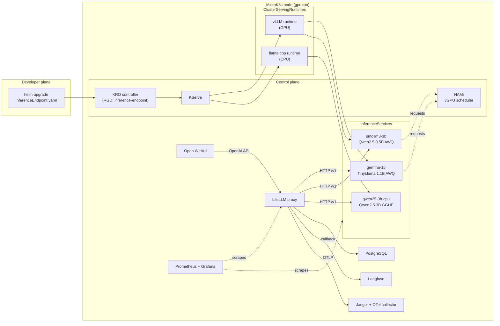
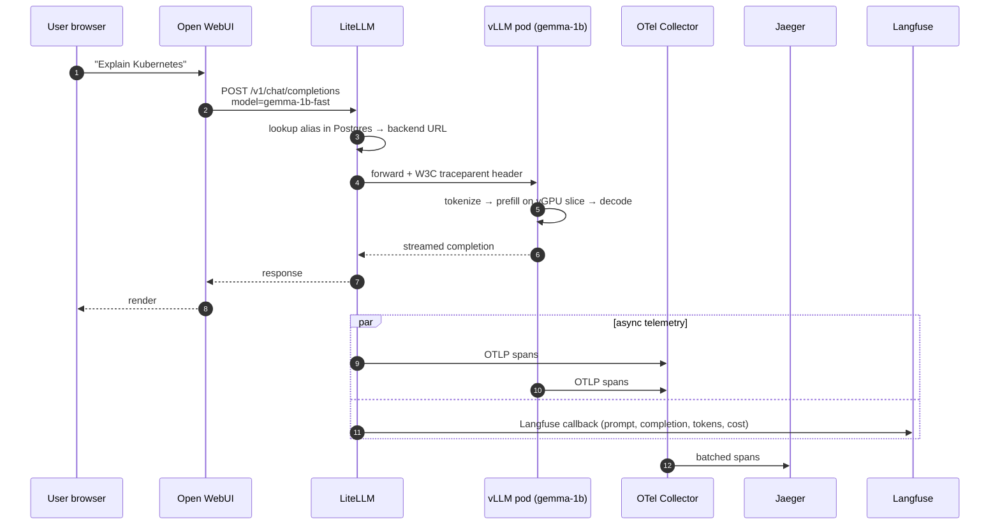
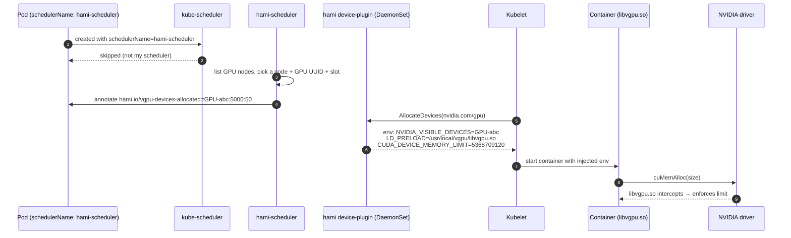

# Architecture — AI Platform (On-prem PoC)

> Companion docs: [documentation.md](documentation.md) (install & operations) ·
> [deploy_new_models.md](deploy_new_models.md) (adding models) ·
> [../README.md](../README.md) (overview & quick start)

This document explains **how the platform is built and why**. It covers the
design goals, the recorded architectural decisions, the high- and low-level
design, each component in depth, the observability architecture, and the path
from this single-GPU PoC to production hardware.

---

## Table of contents

1. [Context & goals](#1-context--goals)
2. [Architectural decisions](#2-architectural-decisions)
3. [High-level design](#3-high-level-design)
4. [Low-level design](#4-low-level-design)
5. [Components in detail](#5-components-in-detail)
6. [Observability architecture](#6-observability-architecture)
7. [Chart & release topology](#7-chart--release-topology)
8. [Scaling to production](#8-scaling-to-production)
9. [Known limitations & honest critique](#9-known-limitations--honest-critique)
10. [References](#10-references)

---

## 1. Context & goals

The platform reproduces the developer experience from the AWS re:Invent talk
*"Building an Internal AI Platform with KRO"* — but ported from
EKS + Karpenter + ACK + Knative to a **single-node MicroK8s box with one
NVIDIA RTX 3080 (10 GB)**, using open-source equivalents throughout.

The north-star use case: a developer applies a single `InferenceEndpoint` YAML
and, within minutes, the model is live, GPU-partitioned, observable, and
chat-accessible — without ever touching infrastructure.

### What the PoC does

```text
helm upgrade applies InferenceEndpoint YAML  ← developer action
   ↓
KRO expands the InferenceEndpoint CR         ← abstraction layer
   ↓
KServe creates the Deployment + Service      ← serving infra
   ↓
HAMi schedules the pod onto a vGPU slice     ← GPU sharing
   ↓
vLLM downloads the weights from HF           ← model load
   ↓
Job registers the model in LiteLLM           ← gateway registration
   ↓
Model appears in Open WebUI                  ← user access
```

### Non-goals (deliberate)

| Non-goal | Rationale |
|---|---|
| Production-grade hardening | Master keys are hard-coded, single replicas, plain-HTTP ingress. The PoC optimises for clarity, not security. See the hardening checklist in [documentation.md](documentation.md#13-production-hardening-checklist). |
| Multi-GPU at the reference node | Tensor parallelism is *implemented* (`gpuCards` → vLLM `--tensor-parallel-size`), but the reference box has one GPU, so examples ship `gpuCards: 1`. See [§8](#8-scaling-to-production). |
| Training / fine-tuning | Serving only. |

### Why it exists

1. **Validate the stack.** Prove KRO + KServe + HAMi + LiteLLM + Open WebUI +
   Langfuse + Jaeger compose into a coherent on-prem platform on commodity
   hardware.
2. **De-risk the production platform.** Every choice here (KServe vs Ray, HAMi vs MIG,
   single gateway vs direct routing) must hold up later on L40S/H200 hardware.
   Being wrong now — on hardware that costs nothing per hour — is cheap.
3. **Self-service developer experience.** Once up, the team adds models with a
   Helm upgrade and never touches infrastructure. That is what scales a team.

---

## 2. Architectural decisions

Each decision is recorded with its trade-offs and the alternatives rejected.

### 2.1 KServe RawDeployment instead of Ray Serve

| Aspect | Choice | Reason |
|---|---|---|
| Serving runtime | KServe RawDeployment | Single-GPU ⇒ no distributed inference needed. Standard HPA + clean ServingRuntime pattern. |
| Mode | RawDeployment (no Knative) | vLLM cold-start of 60–300 s makes scale-to-zero impractical; Knative adds queue-proxy + Istio overhead. |
| vLLM runtime | Custom `ClusterServingRuntime` | KServe ships TGI/Triton/MLServer out of the box, not vLLM. |

**Rejected:** Ray Serve + KubeRay (overkill on one GPU; revisit at multi-GPU
TP), plain vLLM Deployment (loses the abstraction, autoscaling, inference
protocol), Triton (mature but harder to wire to OpenAI chat APIs).

### 2.2 HAMi for GPU sharing

| Aspect | Choice | Reason |
|---|---|---|
| GPU sharing | HAMi vRAM partitioning | The only option with **real vRAM isolation** on a consumer GPU. |

**Rejected:** NVIDIA time-slicing (zero memory isolation — one greedy pod OOMs
the rest), MIG (unsupported on Ampere consumer cards; reserved for the L40S
path), MPS (good latency, no vRAM isolation, complex in K8s).

### 2.3 KRO for the abstraction layer

| Aspect | Choice | Reason |
|---|---|---|
| Abstraction | KRO `ResourceGraphDefinition` | First-class CRD, controller reconciliation loop, typed schema with defaults, automatic status aggregation, CEL substitution. |

**Rejected:** Helm-only values (templating, no reconciliation loop), Crossplane
v2 (mature but heavy), custom Kubebuilder operator (max control, weeks of work).

**Accepted risk:** KRO is `v1alpha1`; the API may change. Re-evaluate in 6
months. CEL ternaries are fragile across versions — regression-test on bumps.

### 2.4 Shared PostgreSQL for LiteLLM + Langfuse

One PostgreSQL StatefulSet, two logical databases (`litellm`, `langfuse`) — the
"Platform DB" pattern. **Rejected:** one Postgres per service (wasted RAM on a
homelab; fine in prod), SQLite (blocks multi-replica HPA for LiteLLM).

### 2.5 LiteLLM as the single gateway

Every request transits LiteLLM regardless of backend (local vLLM, local
llama.cpp, OpenAI, Anthropic, Bedrock…). This buys per-team budgets, virtual
API keys, unified callbacks (Langfuse + OTel in one place), and A/B testing by
alias swap. **Accepted risk:** SPOF + ~10–20 ms overhead, mitigated by HPA and
2+ replicas in prod.

### 2.6 OTel Collector instead of direct-to-Jaeger

A central OTel Collector; clients emit OTLP, the collector routes to the
backend(s). Lets you swap backend (Tempo, Datadog, Honeycomb) without touching
clients, enriches spans via the `k8sattributes` processor, protects against
spike OOMs with `memory_limiter`, and enables tail sampling later.
**Rejected:** direct OTLP → Jaeger, deprecated Jaeger Agent.

### 2.7 Jaeger all-in-one for the PoC

Single pod, in-memory storage — easy to demo, traces vanish on restart. Prod
swaps to Jaeger Production with Elasticsearch, or Grafana Tempo.

### 2.8 Helm + a single bootstrap script

The PoC is installed by `scripts/deploy.sh`, a deliberate chain of
`helm upgrade --install` commands. It is idempotent: re-running it is the
supported upgrade and reconciliation path for every bundled chart. Each app is
its own Helm release (see [§7](#7-chart--release-topology)).

---

## 3. High-level design

### 3.1 Component map



### 3.2 Namespace map

| Namespace | What lives here |
|---|---|
| `cert-manager` | cert-manager controller + CRDs |
| `kserve` | KServe controller, webhooks, CRDs |
| `kro-system` | KRO controller + RGDs |
| `kube-system` | HAMi scheduler + device-plugin DaemonSet |
| `observability` | kube-prometheus-stack (Prometheus, Alertmanager, Grafana) + bundled dashboards/ServiceMonitors |
| `ai-platform` | LiteLLM, Open WebUI, Langfuse, PostgreSQL, Jaeger, OTel Collector, UI ingresses |
| `inference` | `InferenceEndpoint` CRs, `InferenceService`s, model pods, registration Jobs, ClusterServingRuntime config, shared model-cache PVC |

### 3.3 Request flow — one end-to-end inference



---

## 4. Low-level design

### 4.1 `InferenceEndpoint` → expanded resources

A developer commits a single CR:

```yaml
apiVersion: kro.run/v1alpha1
kind: InferenceEndpoint
metadata:
  name: gemma-1b
  namespace: inference
spec:
  backend: vllm
  model: "TheBloke/TinyLlama-1.1B-Chat-v1.0-AWQ"
  servedName: "gemma-1b"
  gpuCards: 1              # tensor-parallel size; 2+ shards across GPUs
  gpuMemMb: 5000
  gpuMemPercentage: 30
  gpuCorePercent: 35
  quantization: "awq"
  maxModelLen: 2048
  gpuMemUtilization: "0.85"
  litellmAlias: "gemma-1b-fast"
```

The `inference-endpoint` RGD
(`charts/kro-templates/templates/inference-endpoint-rgd.yaml`) expands it
into two KRO-managed children plus a KServe-derived chain:

```text
InferenceEndpoint (KRO)                  ← from charts/ai-models/templates/<model>.yaml
   └─ KServe InferenceService            ← rendered by KRO (RGD)
         ├─ Deployment                   ← rendered by KServe
         │    └─ Pod (schedulerName: hami-scheduler)
         │         └─ container: vllm/vllm-openai:v0.6.3
         ├─ Service (ClusterIP :80 → :8000)
         └─ HPA (min=1, max=1)

Job: <name>-litellm-register             ← shipped alongside the model file
   ├─ wait for /v1/models on the pod        (ai-models registerJob helper)
   └─ POST /model/new on LiteLLM
```

KRO expands the `InferenceEndpoint` into the KServe `InferenceService` (which
deploys the model) and aggregates its status (`status.endpointUrl`). Each model
file also ships a self-contained `<name>-litellm-register` Job (via the
`ai-models.registerJob` helper) that waits for `/v1/models` on the new pod, then
POSTs it to LiteLLM — so it never races KServe readiness.

**Multi-backend dispatch.** The RGD is unified — `spec.backend` drives CEL
ternaries that select the model format and runtime:

```text
modelFormat.name : backend == "vllm" ? "vllm" : "gguf"
runtime          : backend == "vllm" ? "vllm-runtime" : "llamacpp-runtime"
nvidia.com/gpu   : backend == "vllm" ? <gpuCards> : "0"
```

Both backends' env vars are always injected; each runtime ignores the
irrelevant ones (vLLM ignores `MODEL_FILE`, llama.cpp ignores `MODEL_ID`). This
avoids fragile CEL conditional-list construction.

**Rollout strategy — `Recreate`.** The RGD pins every predictor `Deployment` to
`deploymentStrategy.type: Recreate` (terminate-before-create) instead of the
default `RollingUpdate` surge. The default would briefly run the old and new
pods together, and each holds a HAMi slice (`gpumem-percentage` **and**
`gpucores`). With two GPU models already consuming ~70 % of cores, a third
surged slice exceeds 100 % and the new pod hangs `Pending` with
`CardInsufficientCore` — a deadlock the rollout never escapes. `Recreate` frees
the old slice first; the trade-off is a brief gap (seconds–minutes) while the
model reloads, which is acceptable for single-replica PoC models.

### 4.2 HAMi vGPU allocation in detail



The crucial detail: `CUDA_DEVICE_MEMORY_LIMIT` is enforced **inside the
container** by `libvgpu.so` intercepting CUDA driver calls. Two pods on the same
physical GPU each see "their" 5 GB and OOM cleanly past it — real isolation, not
cooperative time-slicing.

**Resource model:**

| Resource | Unit | Meaning |
|---|---|---|
| `nvidia.com/gpu` | count | Number of vGPU devices per pod (default 1; set per model via `gpuCards` for tensor parallelism) |
| `nvidia.com/gpumem` / `gpumem-percentage` | MiB / % | **Hard** vRAM cap |
| `nvidia.com/gpucores` | % | **Soft** compute share |

> MicroK8s HAMi v2.8 uses `gpumem-percentage` rather than absolute `gpumem` to
> avoid Kubernetes quantity coercion; `gpuMemMb` is retained for documentation
> and backward compatibility.

### 4.3 Multi-GPU / tensor parallelism

`spec.gpuCards` (default `1`) is the per-model knob for spreading a model across
N GPU cards via vLLM tensor parallelism. It threads through three places in the
RGD and runtime:

1. **Device count** — `nvidia.com/gpu` request **and** limit resolve to
   `gpuCards` (when `backend=vllm`).
2. **Runtime arg** — a `TENSOR_PARALLEL_SIZE` env var feeds vLLM's
   `--tensor-parallel-size="$TENSOR_PARALLEL_SIZE"`.
3. **Per-card sizing** — `gpuMemPercentage` / `gpuCorePercent` are applied to
   *each* of the N devices by HAMi.

**Requirement.** `gpuCards: N` requests N distinct schedulable GPU devices.
Tensor parallelism needs N real devices — multiple physical cards, or HAMi
configured to advertise multiple vGPU devices. On a single-GPU node a value > 1
leaves the pod `Pending` on `Insufficient nvidia.com/gpu`, which is why bundled
examples keep `gpuCards: 1`. See
[deploy_new_models.md](deploy_new_models.md#5-multi-gpu--tensor-parallelism).

### 4.4 Chat-template fallback in the vLLM runtime

Some HF quants (notably `Qwen/Qwen2.5-0.5B-Instruct-AWQ`) ship without a
`chat_template` in `tokenizer_config.json`; transformers ≥ 4.44 refuses to
synthesize one. The vLLM runtime startup script
(`charts/serving-runtimes/templates/vllm-runtime.yaml`):

1. Probes the tokenizer with `AutoTokenizer.from_pretrained(MODEL_ID)`.
2. Checks whether `tokenizer.chat_template` is truthy.
3. If missing, passes `--chat-template=/etc/vllm/chatml.jinja` (mounted from the
   `vllm-chat-templates` ConfigMap — a generic ChatML).
4. If present, leaves the model's own template untouched.

New ungated quants work even when their authors forgot the template, without
degrading models that ship their own.

### 4.5 Distributed tracing — end-to-end span tree

```text
litellm-proxy / POST /v1/chat/completions   [340 ms]
├── litellm-proxy / litellm.routing         [2 ms]
└── litellm-proxy / POST gemma-1b-pred       [336 ms]
    └── vllm-inference / vllm.chat_comp      [330 ms]
        ├── vllm.tokenize                    [3 ms]
        ├── vllm.prefill                     [120 ms]
        └── vllm.decode (50 tokens)          [205 ms]
```

After the `k8sattributes` processor runs, each span carries
`k8s.namespace.name`, `k8s.pod.name`, `k8s.deployment.name`, `k8s.node.name`,
plus resource attributes `service.name`, `service.namespace`,
`deployment.environment=poc`.

### 4.6 LiteLLM model registration sequence

```text
Job: gemma-1b-litellm-register
  │
  1. wait loop (until the predictor answers /v1/models):
  │    until curl -sf http://gemma-1b-predictor.../v1/models; do sleep 10; done
  │
  2. POST http://litellm.ai-platform.svc:4000/model/new
  │    Authorization: Bearer $LITELLM_MASTER_KEY
  │    body:
  │      model_name:    "gemma-1b-fast"
  │      litellm_params:
  │        model:    "openai/gemma-1b"
  │        api_base: "http://gemma-1b-predictor.inference.svc.cluster.local/v1"
  │        api_key:  "dummy-not-required-for-self-hosted"
  │      model_info:
  │        id: "gemma-1b"
  │        description: "... via KServe + vLLM GPU"
  │
  3. LiteLLM: validate master key → INSERT INTO model_table →
  │           reload router config (no restart) → 200 OK
  │
  4. Job exits 0 → ttlSecondsAfterFinished cleans it up an hour later.
```

The credential (`LITELLM_MASTER_KEY`) is mirrored from the `litellm-secrets`
Secret in `ai-platform` into the `inference` namespace by the `litellm` chart,
because the Job runs in `inference` and Secrets are namespace-scoped.

---

## 5. Components in detail

### 5.1 KRO — Kube Resource Orchestrator

Defines high-level CRDs (`InferenceEndpoint`) that expand into low-level objects
(`InferenceService` + `Job`). Chosen for first-class CRDs, typed schema with
defaults, CEL substitution, and a real controller reconciliation loop (not just
templating). The repo ships exactly one RGD — `inference-endpoint` — which is
multi-backend.

### 5.2 KServe — model serving abstraction

Turns an `InferenceService` (one model) into a Deployment + Service + HPA,
picking the right `ClusterServingRuntime` by `modelFormat`. Decouples *what*
(the model) from *how* (vLLM, Triton, llama.cpp), gives the v2 inference
protocol and HPA for free, and supports storage initializers (PVC, S3, OCI
modelcar) if wanted. Runs in **RawDeployment** mode because vLLM cold-starts in
minutes — scale-to-zero is the wrong trade.

### 5.3 HAMi — vGPU virtualisation

Software GPU virtualization: multiple pods share one physical GPU with hard
vRAM limits and soft compute caps. The only path on a consumer card.

| Component | Where | Role |
|---|---|---|
| `hami-scheduler` (Deployment) | `kube-system` | Custom scheduler; only sees pods with `schedulerName: hami-scheduler`. |
| `hami-device-plugin` (DaemonSet) | `kube-system` | Advertises `nvidia.com/gpu`, `gpumem`, `gpucores`; injects `libvgpu.so`. |
| `hami-webhook` (optional) | `kube-system` | Mutating webhook to auto-attach the scheduler name. |

### 5.4 vLLM `ClusterServingRuntime`

`charts/serving-runtimes/templates/vllm-runtime.yaml`.

| Field | Value |
|---|---|
| Image | `vllm/vllm-openai:v0.6.3` |
| API | OpenAI-compatible on port 8000 |
| Quantization | AWQ (per-InferenceService) |
| Prefix caching | enabled (RadixAttention) |
| Tensor parallelism | `--tensor-parallel-size` driven by `gpuCards` |
| OTLP traces | `--otlp-traces-endpoint=otel-collector:4317` |
| Scheduler | `hami-scheduler` |
| HF auth | optional secret reference (gated models) |
| Model cache | shared PVC across pods |
| Chat-template fallback | ChatML via ConfigMap, only when the tokenizer lacks one |

Args parameterised per InferenceService: `--model`, `--served-model-name`,
`--quantization`, `--max-model-len`, `--gpu-memory-utilization`,
`--tensor-parallel-size`, and optionally `--chat-template`.

### 5.5 llama.cpp `ClusterServingRuntime` (CPU)

`charts/serving-runtimes/templates/llamacpp-runtime.yaml`.

| Field | Value |
|---|---|
| Image | `ghcr.io/ggerganov/llama.cpp:server-b4404` |
| API | OpenAI-compatible on port 8080 |
| GPU | none requested |
| Threads | configurable per model |
| Model file | GGUF on the shared cache PVC |
| Cold start | `wget` the GGUF on first boot if absent |

See [deploy_new_models.md](deploy_new_models.md#4-choosing-a-backend) for when
to choose it.

### 5.6 LiteLLM proxy

Unified OpenAI-compatible gateway over any backend (local vLLM/llama.cpp,
OpenAI, Anthropic, Bedrock, Azure). The PoC uses alias routing, master-key auth
for `/model/new`, a PostgreSQL backend (model list survives restarts),
`langfuse` + `otel` callbacks, and Prometheus metrics on `/metrics`. A single
gateway centralises budgets, virtual keys, callbacks, A/B testing, and fallback.

### 5.7 Open WebUI

ChatGPT-like UI talking to LiteLLM as its OpenAI backend; auto-discovers models
via `/v1/models`. The first user to sign up becomes admin.

```text
OPENAI_API_BASE_URL = http://litellm.ai-platform.svc.cluster.local:4000/v1
OPENAI_API_KEY      = <litellm-master-key>
```

### 5.7a OpenCode (IDE / coding-agent client)

A second client lives in `opencode/config/`. [OpenCode](https://opencode.ai)
points at LiteLLM (`http://litellm.local.ro/v1`) through the
`@ai-sdk/openai-compatible` provider. `update-config.py` regenerates
`opencode.json` from LiteLLM's `/v1/models`, stamping a per-model
`limit: {context, output}` so the agent never requests more than a model's KV
cache can hold. This matters because coding agents inject large tool/system
prompts (~10 k tokens) and default to a huge `output` budget — without the cap,
small local models return `ContextWindowExceededError`. The window each alias
advertises must match the served model's `maxModelLen`/`ctxSize` (see
[deploy_new_models.md §9](deploy_new_models.md#9-sizing-guide)). Tiny models like
TinyLlama (2048) are unusable here — its window is smaller than the agent's
prompt.

### 5.8 Langfuse

LLM-specific observability: prompt/completion logging, token counts, cost
attribution, evaluation runs, dataset management. Next.js UI + API over the
shared PostgreSQL, wired via LiteLLM's `success_callback: [langfuse, otel]`.

### 5.9 PostgreSQL (shared)

One StatefulSet; an init script creates the `litellm` and `langfuse` logical
databases. Credentials in a K8s Secret. Prod swaps for CloudNativePG with
replication and pgBackRest backups.

### 5.10 OTel Collector + Jaeger

**Collector** receives OTLP/gRPC on `:4317`, enriches with `k8sattributes`,
batches, and forwards to Jaeger over OTLP; also exposes Prometheus self-metrics.
**Jaeger** is all-in-one with in-memory storage for the PoC.

---

## 6. Observability architecture

### 6.1 The three pillars (+ one)

| Pillar | Tool | Where |
|---|---|---|
| Metrics | Prometheus + Grafana | `grafana.local.ro` |
| Traces | OTel Collector + Jaeger | `jaeger.local.ro` |
| Logs | (your existing Loki, if wired) | n/a in PoC |
| LLM-specific | Langfuse | `langfuse.local.ro` |

### 6.2 Metric sources

| Source | Endpoint | Scraped by |
|---|---|---|
| vLLM pods | `:8000/metrics` | `PodMonitor` `vllm-inference-pods` |
| LiteLLM | `litellm:4000/metrics` | `ServiceMonitor` |
| HAMi scheduler | `hami-scheduler:metrics` | `ServiceMonitor` |
| HAMi device plugin | `hami-device-plugin:metrics` | `ServiceMonitor` |
| OTel Collector | `:8888,:8889/metrics` | `ServiceMonitor` |
| Jaeger | `:14269/metrics` | `ServiceMonitor` |

The PodMonitor selects on `serving.kserve.io/inferenceservice` (Exists), so any
future KServe SDK / TorchServe / Triton runtime is scraped automatically.

### 6.3 Dashboards & where they live

Dashboards live in the **`monitoring`** chart
(`charts/monitoring/files/dashboards/`) and are auto-imported by the Grafana
sidecar from ConfigMaps labelled `grafana_dashboard: "1"` in `observability`.

- **HAMi GPU Split — Native Metrics** — per-pod vRAM/compute, host & scheduler
  views, using real HAMi series (`vGPU_device_memory_*`, `HostCoreUtilization`,
  `vGPUMemoryAllocated`, `GPUDeviceCoreAllocated`).
- **AI Platform — vLLM Inference** — active/queued requests, TTFT & TPOT percentiles,
  KV-cache utilisation, token throughput.
- KServe ModelServer / TorchServe / Triton / Knative dashboards are bundled but
  empty until a matching runtime is deployed.

Two dashboards were deliberately removed: an old HAMi per-pod dashboard (assumed
metric names HAMi never emitted) and a LiteLLM gateway dashboard (depends on
LiteLLM's Enterprise-only `prometheus` callback, which prevents pod startup
without a license). Gateway telemetry still flows via OTLP → Jaeger.

### 6.4 Langfuse vs Jaeger — when to use which

| Question | Tool |
|---|---|
| Which prompt did model X get at 14:32? | Langfuse |
| Where did the 5 s go — routing, prefill, decode? | Jaeger |
| Who spent the most tokens this week? | Langfuse |
| Why is this one request 10× slower than median? | Jaeger (flame graph) |
| Compare model A vs B output for the same prompt | Langfuse (eval runs) |
| Is the bottleneck the proxy, vLLM prefill, or the network? | Jaeger |

Complementary, not redundant.

---

## 7. Chart & release topology

Every app is its own Helm chart and its own release — there is no monolithic
"platform" chart. The bootstrap script installs them in dependency order.

| Chart | Release ns | Purpose |
|---|---|---|
| `cert-manager` | `cert-manager` | cert-manager (wrapper) |
| `observability-stack` | `observability` | kube-prometheus-stack (wrapper) |
| `hami` | `kube-system` | HAMi vGPU (wrapper) |
| `kro` | `kro-system` | KRO controller (wrapper) |
| `kserve-crd` | `kserve` | KServe CRDs |
| `kserve` | `kserve` | KServe controller |
| `namespaces` | `default` | `ai-platform`, `inference` namespaces |
| `postgresql` | `ai-platform` | Shared LiteLLM + Langfuse DB |
| `litellm` | `ai-platform` | Gateway + ingress + secret mirror |
| `langfuse` | `ai-platform` | Tracing UI + ingress |
| `otel-collector` | `ai-platform` | OpenTelemetry Collector |
| `jaeger` | `ai-platform` | Tracing backend + UI + ingress |
| `open-webui` | `ai-platform` | Chat UI + ingress |
| `serving-runtimes` | `inference` | vLLM + llama.cpp runtimes, HF secret, chat templates, vLLM PodMonitor |
| `monitoring` | `observability` | Grafana dashboards + HAMi ServiceMonitors |
| `kro-templates` | `kro-system` | The `InferenceEndpoint` RGD |
| `ai-models` | `inference` | Example `InferenceEndpoint`s + model-cache PVC + register Jobs |

**Ordering rationale.** Prometheus CRDs (ServiceMonitor/PodMonitor) come from
the observability stack, so it installs before anything that defines monitors.
PostgreSQL installs before LiteLLM/Langfuse (they block on it via init
containers). KServe CRDs precede `serving-runtimes` (ClusterServingRuntime). The
`InferenceEndpoint` CRD (from `kro-templates`) must be `Established` before
`ai-models`. The model-cache PVC lives in `ai-models` (not `serving-runtimes`)
because `microk8s-hostpath` uses `WaitForFirstConsumer` — keeping the PVC with
the first consuming pod avoids a `helm --wait` deadlock.

---

## 8. Scaling to production

### 8.1 Target hardware

3–4 nodes, each 2–4 × L40S 48 GB.

### 8.2 Diffs vs the PoC

| Component | PoC (RTX 3080) | Prod (L40S) |
|---|---|---|
| GPU sharing | HAMi 5 GB/pod | MIG `2g.24gb` + HAMi fallback |
| Models | 1B + 0.5B + 3B | Qwen 32B, Llama 70B AWQ, real embedders |
| Replicas | 1/model | HPA `min=1, max=N` on vLLM metrics |
| Storage | Local hostpath / NFS | Ceph RBD / Longhorn |
| Postgres | Single replica | CloudNativePG HA |
| Jaeger | All-in-one | Production + Elasticsearch |
| Secrets | Hard-coded | External Secrets + Vault |
| LiteLLM | 1 replica | HPA 2–5 replicas + Redis cache |

### 8.3 Hybrid MIG + HAMi on L40S

```text
Node: gpu-node-01 (2 × L40S)
  ├─ L40S #0 — MIG enabled
  │     ├─ MIG 4g.48gb #1 → Qwen 32B FP16 (full)
  │     └─ MIG 4g.48gb #2 → Llama 70B AWQ (full)
  │
  └─ L40S #1 — non-MIG + HAMi
        ├─ HAMi 12 GB → embedder
        ├─ HAMi 12 GB → reranker
        ├─ HAMi 12 GB → NER
        └─ HAMi 12 GB → classifier
```

InferenceServices pick their resource type — big models claim a MIG partition
(`nvidia.com/mig-4g.48gb: 1`), small models a HAMi vGPU
(`nvidia.com/gpu: 1` + `nvidia.com/gpumem: 12000`). Multi-GPU big models combine
MIG/full-card allocation with `gpuCards > 1` for tensor parallelism.

### 8.4 HPA on vLLM metrics (sample)

```yaml
apiVersion: autoscaling/v2
kind: HorizontalPodAutoscaler
metadata:
  name: qwen25-7b-hpa
  namespace: inference
spec:
  scaleTargetRef: { apiVersion: apps/v1, kind: Deployment, name: qwen25-7b-predictor }
  minReplicas: 1
  maxReplicas: 5
  metrics:
    - type: Pods
      pods:
        metric: { name: vllm:num_requests_waiting }
        target: { type: AverageValue, averageValue: "5" }
    - type: Pods
      pods:
        metric: { name: vllm:time_to_first_token_seconds_p95 }
        target: { type: AverageValue, averageValue: "800m" }
  behavior:
    scaleUp:   { stabilizationWindowSeconds: 30,  policies: [{type: Percent, value: 100, periodSeconds: 60}] }
    scaleDown: { stabilizationWindowSeconds: 600, policies: [{type: Percent, value: 25,  periodSeconds: 60}] }
```

Requires Prometheus Adapter to expose vLLM custom metrics on the K8s metrics
API.

---

## 9. Known limitations & honest critique

1. **In-memory Jaeger.** Traces vanish on restart. Prod: ES or Tempo.
2. **CPU model download on cold start.** First llama.cpp boot pulls a 2 GB GGUF
   (30–60 s, longer on slow links). Prod: pre-bake the PVC.
3. **`apt-get install wget` in the llama.cpp wrapper.** Fragile against base
   image changes. Prod: custom image with `wget` baked in.
4. **No OTLP from llama.cpp.** The distributed trace for CPU models stops at the
   LiteLLM → pod boundary. Prod: upstream OTLP or an instrumented sidecar.
5. **CEL ternaries in KRO `v1alpha1`.** Works today, fragile across versions —
   regression-test on KRO bumps.
6. **`nvidia.com/gpu: "0"` for CPU models.** Future strict admission may reject
   it; the safer-but-uglier alternative is two separate RGDs.
7. **Shared model-cache PVC.** Mixes HF cache and GGUF lifecycles. Prod:
   separate PVCs.
8. **Hard-coded llama.cpp `--threads`.** Should derive from `requests.cpu` via
   the Downward API.
9. **Hard-coded secrets & single replicas.** See the hardening checklist in
   [documentation.md](documentation.md#13-production-hardening-checklist).

---

## 10. References

- AWS re:Invent 2026 — *Building an Internal AI Platform with KRO*
- KServe — <https://kserve.github.io/website/>
- KRO — <https://kro.run>
- HAMi — <https://github.com/Project-HAMi/HAMi>
- vLLM — <https://docs.vllm.ai>
- llama.cpp server — <https://github.com/ggerganov/llama.cpp/tree/master/examples/server>
- LiteLLM — <https://docs.litellm.ai>
- Langfuse — <https://langfuse.com/docs>
- OpenTelemetry Collector — <https://opentelemetry.io/docs/collector/>
- Jaeger — <https://www.jaegertracing.io/docs/>
